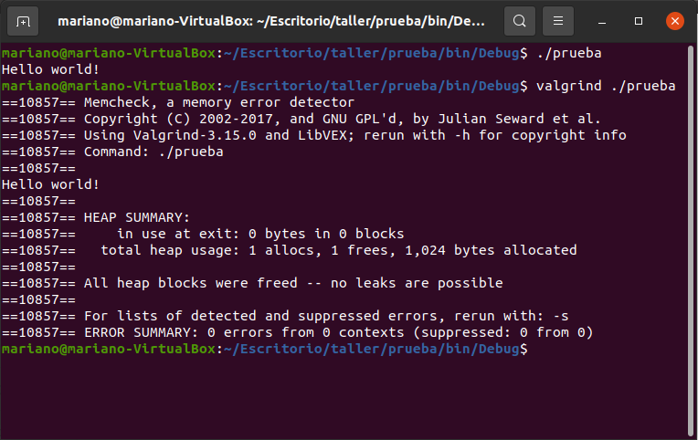
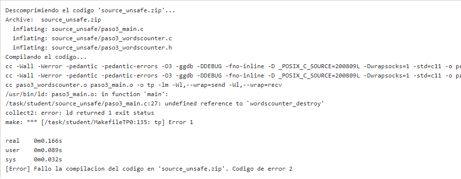
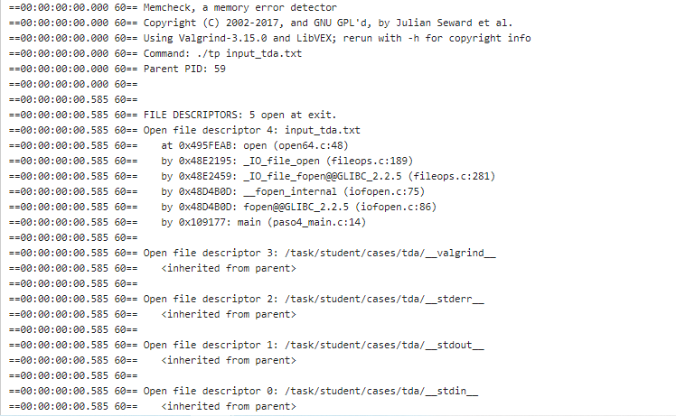
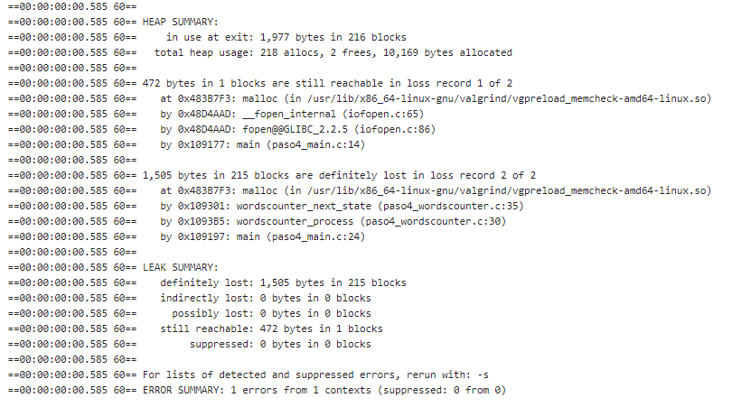
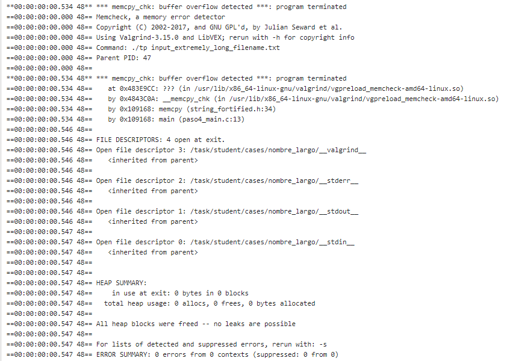
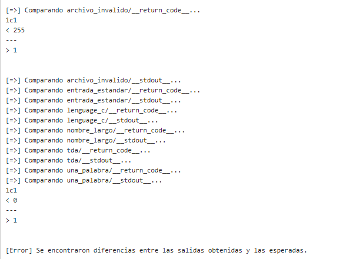
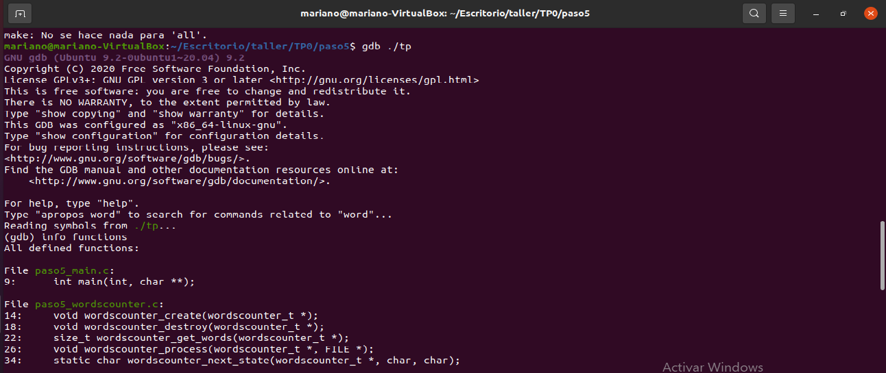
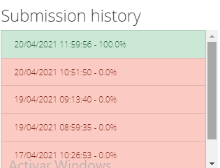
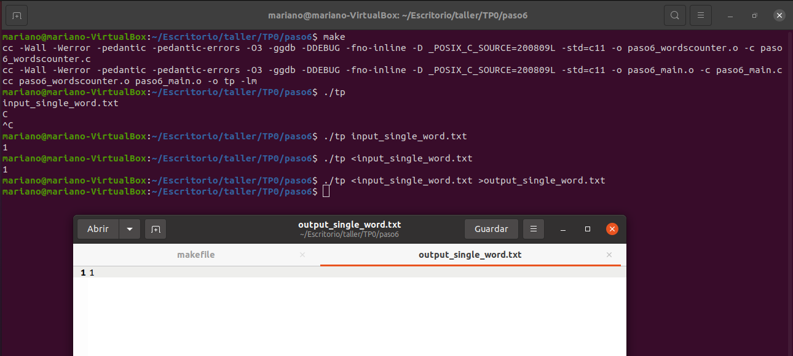

# Taller de programación I 7542

### Nombre y apellido: Mariano Tomas Medela

### Padrón: 101769

### Repositorio: https://github.com/mmedela/TP0-taller

### 1er cuatrimestre de 2021

# Paso 0: 
### a) Entorno de Trabajo

Comenzamos familiriazándonos con el entorno en el que desarrollaremos a lo largo de toda la cursada, para esto compilamos y ejecutamos un programa con y sin valgrind



### b) Valgrind
Valgrind es una herramienta que sirve para poder debugguear y detectar pérdidas de memoria que pueden ocasionarse a lo largo del código.

Las opciones más comunes son:
 `valgrind --tool=memcheck --leak-check=yes programa` Esto lo que permite es contar la cantidad de alocaciones y de veces que se liberó la memoria, en caso de que difiera, también revisa por variables no inicializadas . Para el caso de `--leak check=yes`esté activado, devuelve un resumen que permite revisar dónde hubo una pérdida de memoria. 

### c) sizeof() 
sizeof como su nombre lo indica representa el tamaño que ocupa una variable (en bytes) en memoria. El valor de `sizeof(char)` seria 1 y el de `sizeof(int)` será 4 ya que es lo que ocupan estos tipos de datos respectivamente en la memoria.

Depende de la arquitectura y del compilador.

### d) diferencia sizeof() de una struct respecto a una suma de sizeof() de cada uno de sus elementos. 
El `sizeof()`  de una struct no va a coincidir siempre con la suma de los sizeof() ya que esto dependerá de como estén definidos los elementos (según tamaño) en el struct. Esto es así ya que el compilador agrega _padding_ (osea rellena los espacios vacíos para que respete la alineación especificada del compilador). Un ejemplo para clarificar:

```C
struct Ejemplo {
    int     a; 
    double  b;
    int     c;
 };

``` 
El `sizeof()` de este stuct por ejemplo será 24 ya que a pesar de que los int ocupan 4, se le agregará un padding de 4 para rellenar y llegar a los 8 que es el tamaño máximo que ocupa por el double. 
Si en cambio hiciéramos la suma de los `sizeof()` de cada elemento daría 16.

Es curioso lo que pasa con esa struct en 32 bits, si querés probar.
También te recomiendo probar qué pasa con algo así:
```C
struct OtroEjemplo {
    char   a; 
    short  b;
 };

``` 


### e) STDIN, STDOUT, STDERR

Estos tres flujos estándar le sirven a cualquier programa para operar la entrada y salida cuando se está ejecutando una shell de Unix.

El *stdin* es el diminutivo de standard input y se refiere a todo con lo que recibe por entrada un proceso, puede ser interacción de teclado del usuario o un archivo recibido (en caso de que sea redirigido).
stdin no tiene relación con el teclado sino con su proceso padre, en este caso la terminal, que es una aplicación interactiva y sí maneja eventos del teclado.

*stdout* diminutivo de standard output es la salida el proceso y será mostrado en la terminal.
Análogo al comentario de antes

Por último el *stderr* al igual que los otros dos, el diminutivo es standard error y usa stdout para mostrar los errores al usuario. 

Me gustaría agregar que estos tres estándares son file descriptors y ofrecen universalidad a los programas para poder usarse. Cada estándar tiene un número asociado que hace referencia a un file descriptor.

El caracter ` > ` permite redireccionar el *stdout* de un proceso a un archivo. Un ejemplo puede ser ```ls /home >out.txt``` que manda lo que se encuentre en /home al archivo (se crea) out.txt 

El caracter ` < ` permite redireccionar un archivo a un *stdin* de un proceso. Por ejemplo ```./tp < out.txt``` manda el contenido de out.txt al stdin del programa ./tp

El caracter ` | ` (pipe) funciona como una tubería que conecta el *stdout* a un *stdin* de dos procesos. Puede haber varios concatenados. Ejemplo: ``` ls /home | ./tp  ``` redirige lo que muestre el ls a el *stdin* del programa tp

# Paso 1

### Errores de estilo detectados por el SERCOM:


Errores encontrados en `paso1_wordscounter.c`.

1. En la línea 27 hace falta un espacio antes del while.
2. En la línea 41 encuentra una asimetría entre los espacios adentro del if
3. En la misma línea anterior aclara que debería haber uno o cero espacios entre los paréntesis y la condición.
4. Línea 47 indica que un else debería aparecer en la misma línea que la llave de cierre del 'if' que lo antecedía.
5. Siguiendo en la misma línea establece que debería haber consistencia, si un else tiene una llave de un lado debería asimismo tenerla del otro: `} else { `. 
6. En la línea 48 falta un espacio entre el if y el paréntesis que le sigue.
7. en la línea 53 hay un espacio entre el `; ` de final de linea y el código correspondiente a la misma.
8. Para el archivo `.h` de este programa, en la línea 5 indica que hay una línea con más de 80 caracteres, cuando las líneas deberían ser de 80 o menos. 

Errores encontados en `main.c`: 

1. Recomienda el uso de `snprintf()` en vez de `strcpy()` (línea 12), dado que este último, carece de un limite claro a la hora de copiar un string y esto lo puede llevar a sobreescribir memoria.
2. En la línea 15 indica que debería aparecer un else en la misma línea que la llave que le antecede
3. Línea 15 indica que debería haber llaves en ambos lados del else. 

Vemos que hay un total de 11 errores 

### Salida del SERCOM con errores del ejecutable:


1. En la línea 22 no reconoce el tipo `wordscounter_t`. Este error se da por omitir la libreria con la declaracion cel tipo de dato que se desea utilizar.
2. En la línea 23 falta una declaración de una función llamada `wordscounter_create`
3. En la línea 23 falta también una declaración a la función  `wordscounter_process`
4. En la línea 25 falta también una declaración a la función  `wordscounter_get_words`
5. En la línea 27 falta también una declaración a la función  `wordscounter_destroy`

Estos últimos 4 errores en realidad se tratan de Warnings pero al utilizar un determinado flag de compilación (`-Werror`), lo marca como error. 

El último error te avisa que el makefile no pudo completar la compilación. 


# Paso 2

### a) Cambios respecto version anterior

En el main.c se agregó el archivo "paso2_wordscounter.h", también se cambió la función `strcpy` por `memcpy` y además se corrigió la llave al lado del else en la línea 15. 

Para el wordscounter.c del paso 2 se cambió el espacio del while antes del paréntesis, así como también el espacio de la condición del if que había quedado asimétrica. Se arregló errores de estilo en las líneas 46 y 48 (llaves y espacios).

Por último se modificó el .h para que tuviera menos de 80 caracteres.

### b) Salida SERCOM sin errores de estilo


### c) Salida SERCOM sobre errores de ejecución


Errores: 

1. y 2.  Tanto la línea 7 como la 20 de `wordscounter.h` desconocen el tipo size_t. Falta incluir la biblioteca `stdlib`. Esto corresponde a un error del compilador. 
3. Desconoce el tipo `FILE` en los parámetros de la función `wordscounter_process`. Faltó también agregar una biblioteca en el header. Es un error de compilador.
4.  En la línea 17 en wordscounter.c hay dos tipos que son conflictivos en la función `wordscounter_get_words` y la función `paso2_wordscounter.c`. Esto ocurre porque ambos utilizan size_t y este tipo no esta definido. Es un error del compilador porque no puede determinar el tipo a devolver.
5. El siguiente error es por una declaración del `malloc`en la línea 30 dentro de `wordscounter_next_state` ya que no fue definida antes de su llamada. Esto en realidad es un warning (ya que puede llevar a un error de linker). Sin embargo,debido a los flags utilizados, se considera directamente un error y pasa a ser un error de compilador.
6. El último consiste en el error del makefile que explicita que falló la compilación .

Bien! También se habla de la declaración built-in de malloc, si querés investigar...

# Paso 3

### a) Cambios realizados
Los cambios realizados fueron en el `paso3_wordscounter.c` que se agregó la biblioteca  `stdlib.h`. Además se agregaron dos bibliotecas en `paso3_wordscounter.h` ( `stdio.h`y `string.h`)

### b) Errores de ejecución:



Se encuentra un error en el `main.c` línea 27 ya que tiene una referencia en `wordscounter_destroy`sin definir. Esto se debe a que la función está declarada en el .h pero no está creada en el  `paso3_wordscounter.c`.

Y eso es un error reportado por el compiler o por el linker?

# Paso 4 

### a) Cambios realizados:

Se define la función `wordscounter_destroy` en `paso4_wordscounter.c` pero esta no hace nada.

### b) Salida SERCOM de Valgrind para TDA




Errores:
1. se encuentra abierto el file descriptor 4 y que se perdieron (definitely) 1505 bytes en 215 bloques.
2. No se elimino el TDA al terminar de usarlo y se terminaron perdiendo (still reachable) 472 bytes en un bloques.

### c) Salida SERCOM de Valgrind para long filename 



En este caso Valgrind detectó que se excedió el buffer definido para memcpy ocasionando que el programa cierre de forma forzosa.

### d) Strncpy()

Con `strncpy()` no cambiaría nada, también se excedería el buffer. La ejecucion de prueba hubiese dado error de todos formas, dado que el problema de un buffer muy chico no se solucionó al cambiar de función.
Y qué pasaría si le pasamos el tamaño apropiado a strncpy?

### e) segmentation fault y buffer overflow

El error Segmentation fault ocurre cuando se intenta exceder de la memoria asignada. Un ejemplo puede ser cuando cuando se tiene un array con memoria para 10 elementos pero se intenta acceder por fuera de ese array, al elemento 11 por ejemplo. No, eso es un buffer overflow. Un segmentation fault se da cuando un proceso intenta acceder a una posición de memoria para la que no tiene permisos suficientes (tratar de escribir en el code segment, o tratar de desreferenciar un puntero nulo causan un segmentation fault)

Buffer overflow ocurre cuando valores intentan excederse de los límites asignados a ese overflow,  ya que no ocupan más valores. Si se tuviera un buffer de 100 bytes y se quieren guardar 110 bytes se generará este error. 


# Paso 5

### a) Cambios

Observamos y vemos que los cambios realizados:

 En `worscounter.c` se cambiaron los caracteres delimitadores, antes eran un array y ahora pasó a un puntero con memoria fija, mientras que el array era memoria dinámica. 

 Y finalmente en main.c se agrega que a menos que sea el standard input, que se cierre el parámetro ingresado. Además cuando se abre el archivo en el `fopen` no se usa un buffer para guardar el nombre del archivo

### b) Invalid file y una palabra

 

Tanto para el caso de `invalid_file` como para `una_palabra`, podemos observar una discrepancia entre la cantidad de palabras obtenidas y la esperada. Para ambos casos SERCOM nos ofrece lo que obtuvimos vs. lo que se esperaba, una especie de diff. 

### c) hexdump


Asumiendo el los caracteres mostrados estan escritos en hexadecimal, el ultimo caracter es una 'd'.

Sí, también tenés la representación ASCII a la derecha.

### d) GDB



El debbuger no se detuvo dado que durante la ejecución, nunca se entra al if en donde se encuentra `self->words++ ` de la línea 45

Incompleto: Explique brevemente los comandos utilizados en gdb

# Paso 6

### a) Cambios
Los cambios entre la versión anterior y esta es que en `main.c` se cambió la constante `ERROR` de -1 a 1.

Para el archivo de `wordscounter.c` se arregló la lógica en `wordscounter_next_state.c` para el caso de que haya una sola palabra sin salto de línea al final. 

### b) Historial de submits:




### c) Ejecución local con distintas variantes:



En esta imagen se muestra un editor de texto con el archivo output_single_word.txt abierto, dado que en la última prueba se redirigió el resultado de la misma a este archivo.
